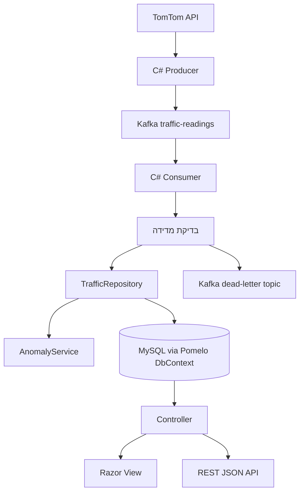
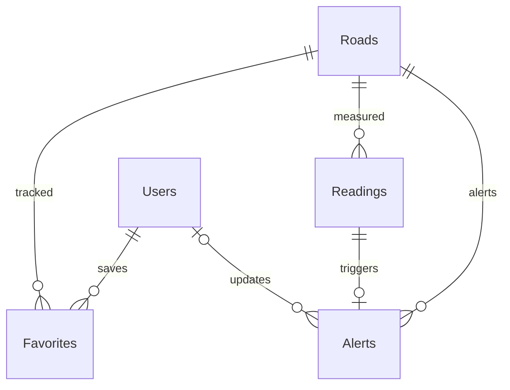
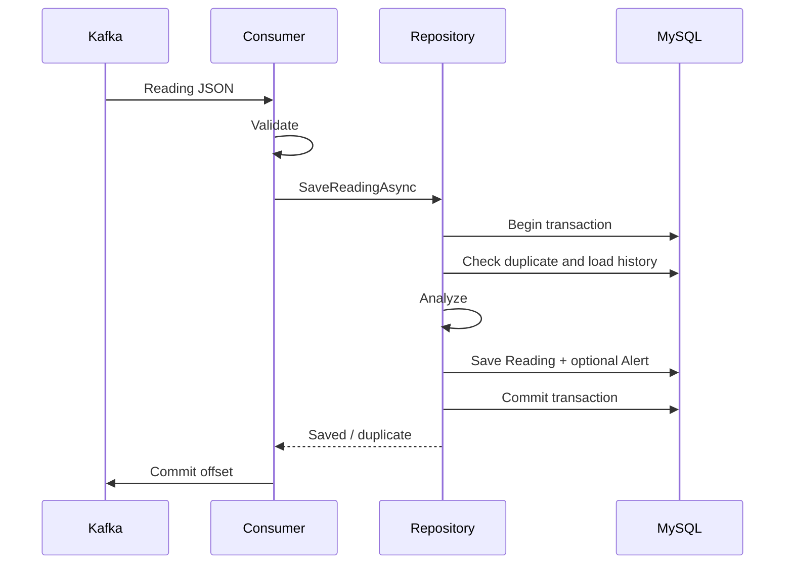

# תרשימי המערכת

## זרימת נתונים

## קשרים בין חמש הטבלאות

## אישור הודעה

## החלטות תכנון

- MVC מוכר לצוות, במקום מסגרת Frontend נפרדת.
- MySQL הוא מקור האמת. אין Redis או MongoDB שאינם נדרשים לתכולה שנבחרה.
- Producer ו־Consumer הם תהליכים נפרדים; Shared מכיל רק קוד משותף.
- Repository Scoped עם DbContext Scoped: אין שיתוף DbContext בין threads או בקשות.
- עדכוני מקטעים והתרעות משתמשים ב־Version כדי לא לדרוס שינוי מקביל.
- אין מחיקה של מקטעים בעלי היסטוריה; משביתים אותם.
- הנתונים מאוחסנים ב־UTC ומוצגים לפי ישראל. אותו יום בשבוע נקבע באזור הזמן של הניתוח.
- בעת כשל מקור הנתונים נשארת המדידה האחרונה עם סימון חוסר עדכניות.
- השליטה בניתוח נמצאת בהגדרות Analysis ובסף המקטע, לא במספרים הפזורים בקונטרולרים.

## גבולות הגרסה

- רשימת משתמשים מוגבלת ל־1,000, התרעות ל־200, והיסטוריה למסך/API ל־500 מדידות; אין כרגע דפדוף עמודים.
- כל מדידה חריגה יכולה ליצור התרעה; אין עדיין איחוד סדרת מדידות לאירוע רציף אחד.
- אין שחזור סיסמה בדואר או אימות כתובת דואר.
- אין מפה גאוגרפית; יש רשימה, פרטים וגרף מהירות.
- ההדגמה בקובץ מיועדת לתהליך יחיד ולהיקף קטן, ואין לה מדיניות מחיקה אוטומטית.
- ב־MySQL אין עדיין ארכוב היסטוריה מתוזמן. בפריסה ממושכת יש להגדיר מדיניות שמירה וגיבוי.
- ה־Producer מנסה לפרסם עד שלוש פעמים; כשל ממושך לפני אישור Kafka עלול לאבד את המדידה שנאספה. הוא נרשם בלוג. לאחר אישור Kafka, השחזור מוגבל לתקופת השמירה של broker.
- Broker יחיד במחשב פיתוח אינו תשתית High Availability.
